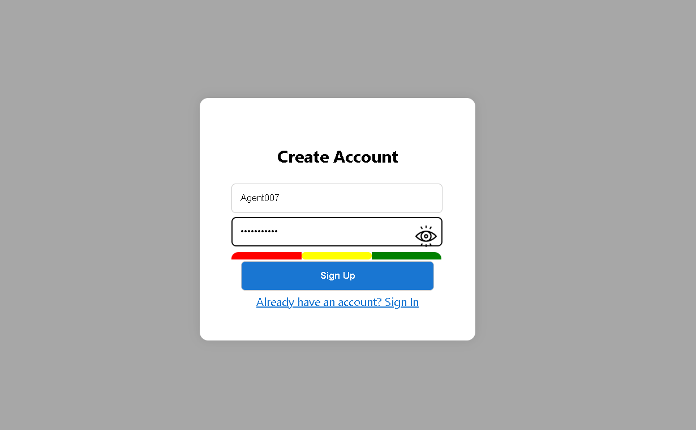
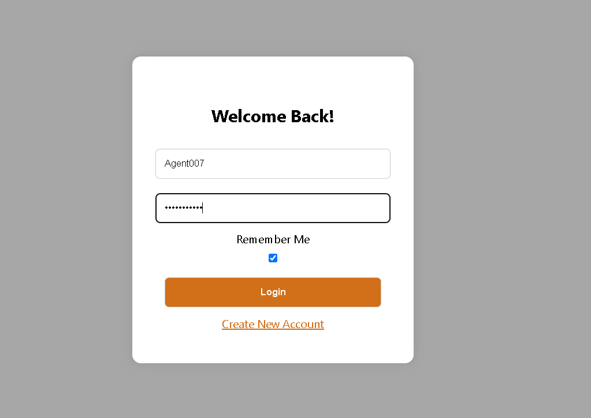

# Form Validation and Authentication

A simple yet functional web-based form validation and authentication system built using **HTML**, **CSS**, and **JavaScript**. The project includes a **Signup**, **Login**, and **Welcome** page with key client-side authentication features.

## 🚀 Features

### ✅ Signup Page
- Username and password validation
- Password strength indicator
- Duplicate username prevention
- User data storage via `localStorage`

### 🔐 Login Page
- Credential validation
- "Remember Me" functionality using cookies
- Redirection to the welcome page after successful login

### 🙌 Welcome Page
- Personalized greeting
- Logout functionality

## 📁 Folder Structure


Form-Validation-and-Authentication/
├── login.html
├── signup.html
├── welcome.html
├── assets/
│   ├── closed\_eye.png
│   └── open\_eye.png
├── linkedin post data/
│   └── 2025-05-08 21-44-24.mp4
└── README.md

## 🛠 How to Run

1. **Clone the repository:**
   ```bash
   git clone https://github.com/jalal1122/Form-Validation-and-Authentication.git
   cd Form-Validation-and-Authentication
2. **Open `signup.html`** in your browser to create a new account.

3. **Login** using the newly created credentials via `login.html`.

4. **Access** the personalized `welcome.html` page upon successful authentication.

5. **Logout** anytime using the Logout button on the welcome page.

## 🖼️ Screenshots

### Signup Page


### Login Page


### Welcome Page


## 🧰 Technologies Used

* **HTML** – Page structure
* **CSS** – Styling and layout
* **JavaScript** – Form validation and authentication logic

## 📈 Future Enhancements

* Add server-side authentication (e.g., Node.js & Express)
* Replace `localStorage` with a real database (e.g., MongoDB)
* Implement password hashing (e.g., bcrypt)
* Make the UI responsive and mobile-friendly

## 🪪 License

This project is licensed under the [MIT License](LICENSE).

---

> Built with 💻 by [Muhammad Jalal](https://github.com/jalal1122)
---
